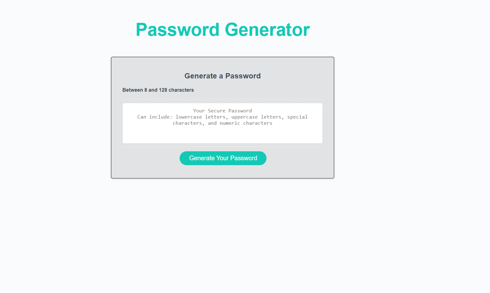

# Password_Generator

## Description
This is an application that can generate a random password based on certain criterias. This application uses HTML, CSS, and Javascript to function. The user can choose between lowercase letters, uppercase letters, special characters, and numerical charachters. 

Do you ever find yourself with too many security risk and repeating passwords. This website will help you with all these problems. With this website, you will be able to generate random, security strong passwords with criteria that you can alter.

## Usage

## Credits
[HTML ASCII Reference](https://www.w3schools.com/charsets/ref_html_ascii.asp)

[MDN Web_Docs  Array.from()](https://developer.mozilla.org/en-US/docs/Web/JavaScript/Reference/Global_Objects/Array/from)

[HTMl Element Reference](https://developer.mozilla.org/en-US/docs/Web/HTML/Element)

## Deployment

[GitHub Repository](https://github.com/Develepor-Dan/Password_Generator)

[Password Generator](https://develepor-dan.github.io/Password_Generator/)

